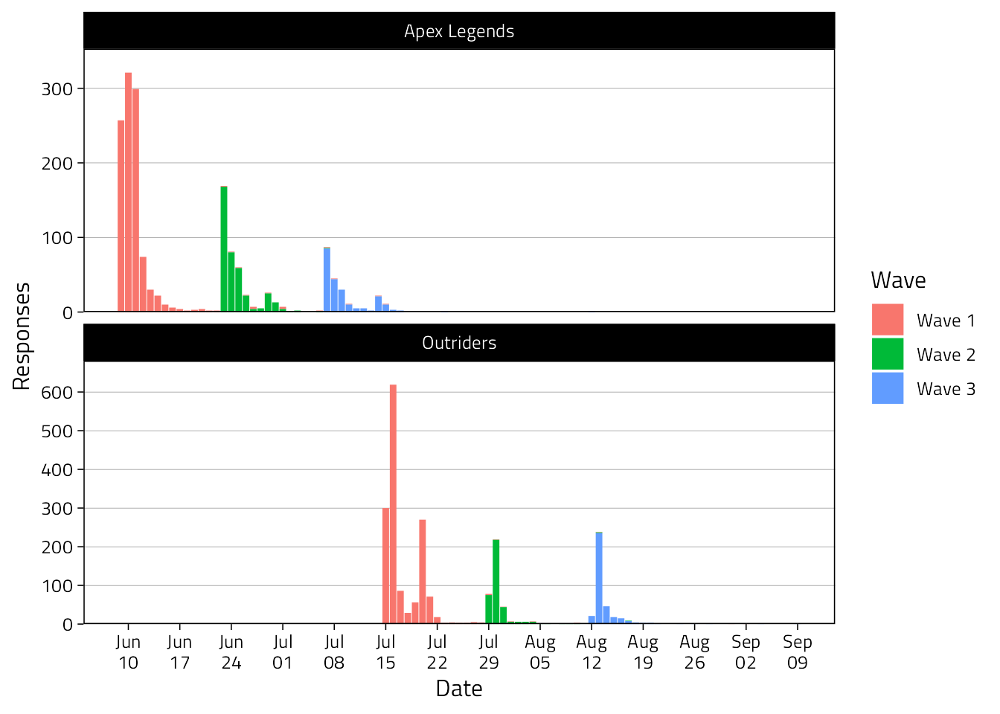
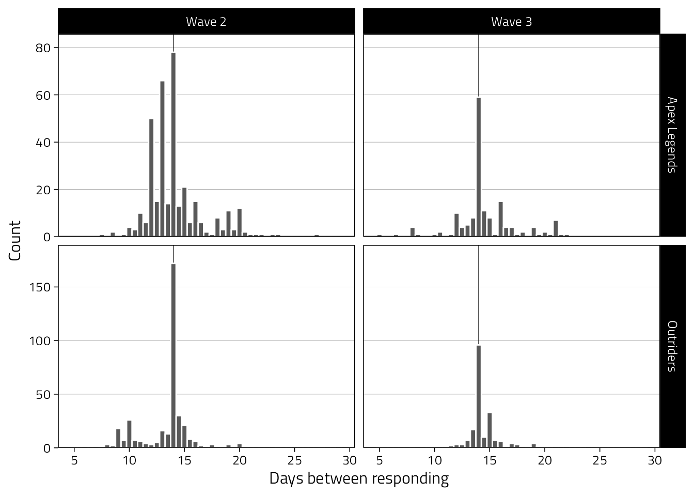
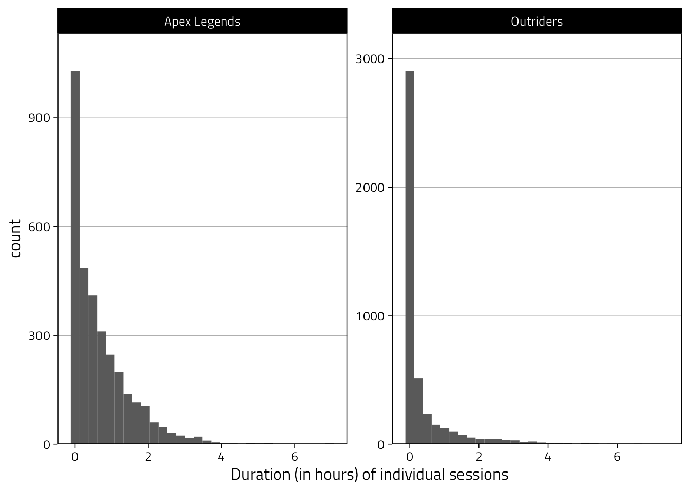
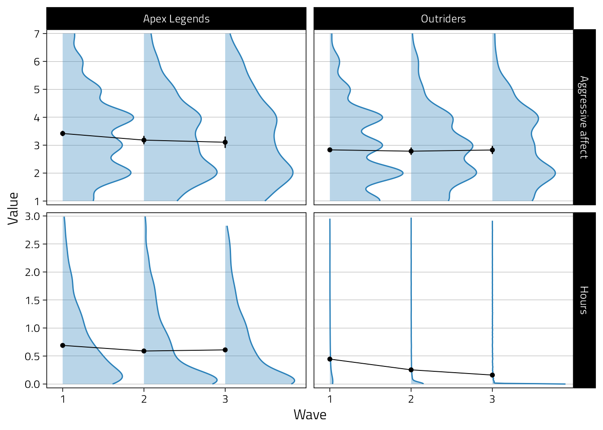
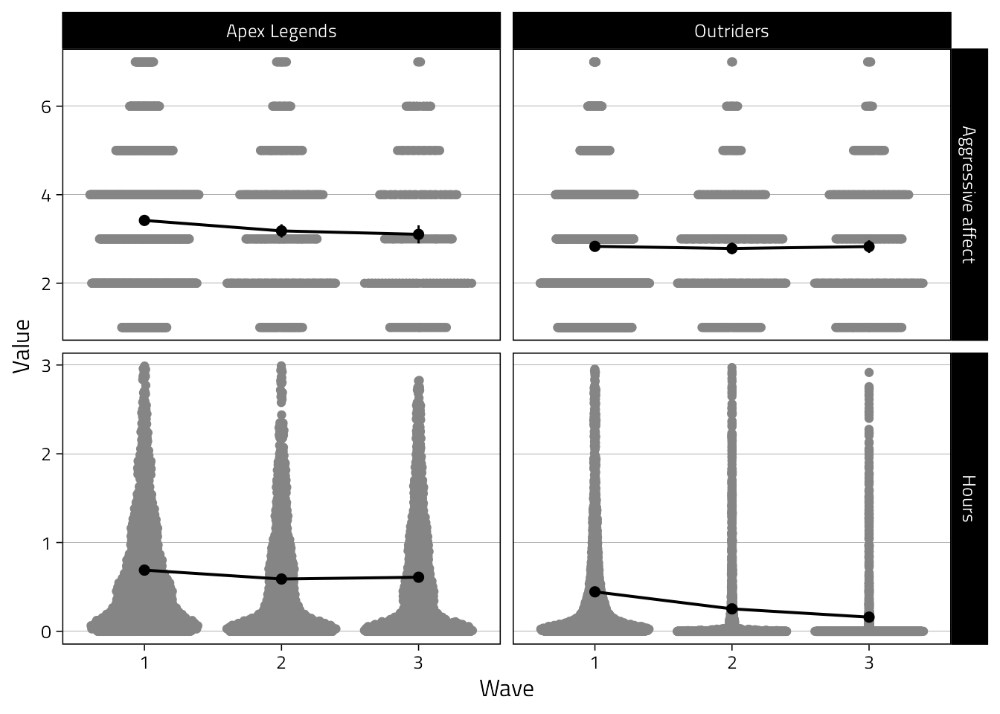

# Descriptives

Load packages.
Once more: All code is almost one-to-one copied from Vuorre et al.

```r
library(knitr)
library(scales)
library(gtsummary)
library(kableExtra)
library(here)
library(showtext)
library(tidyverse)
library(lubridate)
library(ggdist)
library(ggstance)
library(extrafont)
library(janitor)
library(broom.mixed)
library(ggbeeswarm)
```


Set figure options like before.

```r
# Plotting options
Font <- "Titillium Web"
font_add_google(Font, Font)
theme_set(
  theme_linedraw(
    base_family = Font,
    base_size = 12
  ) +
    theme(
      panel.grid.minor = element_blank(),
      panel.grid.major.x = element_blank()
    )
)

col1 <- "#2980b9"
col2 <- "#2980b9"
```

Next, we load the cleaned data set from the previous section.

```r
data_path <- here("data", "cleaned_data.rds")
if (file.exists(data_path)) {
  d <- read_rds(file = data_path)
} else {
  stop(str_glue("{data_path} doesn't exist, run `01-process.Rmd` to create it."))
}
```

## Demographics final sample

Then we create a table that showcases all demographic information.

```r
d %>%
  filter(wid == 1) %>%
  distinct(pid, Game, Age, Experience, Gender) %>%
  select(-pid) %>%
  tbl_summary(by = Game, missing_text = "Missing") %>%
  add_overall() %>%
  bold_labels() %>%
  italicize_levels() -> table1

if (!dir.exists(here("output"))) {
  dir.create("output", FALSE)
}

if (!file.exists(here("output", "table1.docx"))){
  table1 %>% 
    as_flex_table() %>% 
    flextable::save_as_docx(path = here("output", "table1.docx"))
}

table1 %>% 
  as_kable_extra(caption = "Sample demographics") %>% 
  kable_styling(full_width = FALSE, font_size = 12)
```

<table style="NAborder-bottom: 0; font-size: 12px; width: auto !important; margin-left: auto; margin-right: auto;" class="table">
<caption style="font-size: initial !important;">(\#tab:unnamed-chunk-4)Sample demographics</caption>
 <thead>
  <tr>
   <th style="text-align:left;"> Characteristic </th>
   <th style="text-align:left;"> Overall, N = 2,580 </th>
   <th style="text-align:left;"> Apex Legends, N = 1,092 </th>
   <th style="text-align:left;"> Outriders, N = 1,488 </th>
  </tr>
 </thead>
<tbody>
  <tr>
   <td style="text-align:left;"> Age </td>
   <td style="text-align:left;"> 33 (25, 41) </td>
   <td style="text-align:left;"> 25 (20, 32) </td>
   <td style="text-align:left;"> 38 (32, 45) </td>
  </tr>
  <tr>
   <td style="text-align:left;padding-left: 2em;" indentlevel="1"> Missing </td>
   <td style="text-align:left;"> 5 </td>
   <td style="text-align:left;"> 3 </td>
   <td style="text-align:left;"> 2 </td>
  </tr>
  <tr>
   <td style="text-align:left;"> Gender </td>
   <td style="text-align:left;">  </td>
   <td style="text-align:left;">  </td>
   <td style="text-align:left;">  </td>
  </tr>
  <tr>
   <td style="text-align:left;padding-left: 2em;" indentlevel="1"> Man </td>
   <td style="text-align:left;"> 2,308 (90%) </td>
   <td style="text-align:left;"> 948 (87%) </td>
   <td style="text-align:left;"> 1,360 (92%) </td>
  </tr>
  <tr>
   <td style="text-align:left;padding-left: 2em;" indentlevel="1"> Non-binary / third gender </td>
   <td style="text-align:left;"> 38 (1.5%) </td>
   <td style="text-align:left;"> 23 (2.1%) </td>
   <td style="text-align:left;"> 15 (1.0%) </td>
  </tr>
  <tr>
   <td style="text-align:left;padding-left: 2em;" indentlevel="1"> Prefer not to say </td>
   <td style="text-align:left;"> 31 (1.2%) </td>
   <td style="text-align:left;"> 15 (1.4%) </td>
   <td style="text-align:left;"> 16 (1.1%) </td>
  </tr>
  <tr>
   <td style="text-align:left;padding-left: 2em;" indentlevel="1"> Woman </td>
   <td style="text-align:left;"> 198 (7.7%) </td>
   <td style="text-align:left;"> 103 (9.5%) </td>
   <td style="text-align:left;"> 95 (6.4%) </td>
  </tr>
  <tr>
   <td style="text-align:left;padding-left: 2em;" indentlevel="1"> Missing </td>
   <td style="text-align:left;"> 5 </td>
   <td style="text-align:left;"> 3 </td>
   <td style="text-align:left;"> 2 </td>
  </tr>
  <tr>
   <td style="text-align:left;"> Experience </td>
   <td style="text-align:left;"> 25 (16, 31) </td>
   <td style="text-align:left;"> 17 (10, 25) </td>
   <td style="text-align:left;"> 30 (22, 35) </td>
  </tr>
  <tr>
   <td style="text-align:left;padding-left: 2em;" indentlevel="1"> Missing </td>
   <td style="text-align:left;"> 11 </td>
   <td style="text-align:left;"> 6 </td>
   <td style="text-align:left;"> 5 </td>
  </tr>
</tbody>
<tfoot><tr><td style="padding: 0; " colspan="100%">
<sup>1</sup> Median (IQR); n (%)</td></tr></tfoot>
</table>

## Descriptives survey

### Retention rates

Below, we see how many players responded to each survey to calculate retention.
Please note that the number of wave 1 participants will be slightly different that in previous tables.
In previous tables, we counted anyone who had telemetry for one wave and who responded to one wave (on the angry item).
Here, we filtered by whether someone responded.
So if a person consented to participate, didn't fill anything in in wave 1, but got recontacted and filled in everything for waves 2 and 3, they won't count towards completed wave 1 one here, but towards the total sample.


```r
# Get data on invite dates and Ns
if (!file.exists(here("data", "invites.csv"))){
  download.file("https://osf.io/8uk2x/download", here("data", "invites.csv"), mode = "wb" )
}

invites <- read_csv(here("data", "invites.csv")) %>%
  rename(Game = game) %>%
  filter(Game %in% c("Apex Legends", "Outriders"))

# Create a table where wave 0 are number of invites,
# then calculate response rate / retention at each wave.
# This assumes there are no new participants at wave 3
# (people who didn't participate in wave 2 showed up at wave 3).
bind_rows(
  select(invites, -date),
  d %>% filter(Responded) %>% count(Game, wid)
) %>%
  arrange(Game, wid) -> retention

retention %>%
  group_by(Game) %>% 
  mutate(
    R_rate = percent(n / lag(n), .01),
    n = comma(n)
  ) %>% 
  pivot_wider(names_from = wid, values_from = c(n, R_rate)) %>%
  mutate(
    Invites = n_0,
    `Wave 1` = str_glue("{n_1} ({R_rate_1})"),
    `Wave 2` = str_glue("{n_2} ({R_rate_2})"),
    `Wave 3` = str_glue("{n_3} ({R_rate_3})")
  ) %>%
  select(Game, Invites:`Wave 3`) %>%
  mutate(across(everything(), ~ str_replace(., "NA", "0"))) %>%
  kbl(caption = "Number of people (response/retention rate) participating at each wave.") %>% 
  kable_styling(full_width = FALSE, font_size = 12)
```

<table class="table" style="font-size: 12px; width: auto !important; margin-left: auto; margin-right: auto;">
<caption style="font-size: initial !important;">(\#tab:unnamed-chunk-5)Number of people (response/retention rate) participating at each wave.</caption>
 <thead>
  <tr>
   <th style="text-align:left;"> Game </th>
   <th style="text-align:left;"> Invites </th>
   <th style="text-align:left;"> Wave 1 </th>
   <th style="text-align:left;"> Wave 2 </th>
   <th style="text-align:left;"> Wave 3 </th>
  </tr>
 </thead>
<tbody>
  <tr>
   <td style="text-align:left;"> Apex Legends </td>
   <td style="text-align:left;"> 900,000 </td>
   <td style="text-align:left;"> 1,053 (0.12%) </td>
   <td style="text-align:left;"> 385 (36.56%) </td>
   <td style="text-align:left;"> 219 (56.88%) </td>
  </tr>
  <tr>
   <td style="text-align:left;"> Outriders </td>
   <td style="text-align:left;"> 90,000 </td>
   <td style="text-align:left;"> 1,483 (1.65%) </td>
   <td style="text-align:left;"> 371 (25.02%) </td>
   <td style="text-align:left;"> 359 (96.77%) </td>
  </tr>
</tbody>
</table>

### Response dates

We only plot response dates where participants responded to the anger item.
We see that some very few participants filled out wave 3 extremely late.
They will have received a negative interval (see processing) and thus only have one wave of valid data.


```r
d %>%
  # Take only actually responded-to waves
  filter(Responded) %>%
  mutate(Date = as_date(StartDate)) %>%
  count(Game, Wave, Date) %>%
  ggplot(
    aes(Date, n, fill = Wave)
  ) +
  geom_col() +
  scale_y_continuous(
    "Responses",
    breaks = pretty_breaks(),
    expand = expansion(c(0, .1)),
  ) +
  scale_x_date(
    "Date",
    date_breaks = "7 day", date_labels = "%b\n%d", date_minor_breaks = "1 day"
  ) +
  facet_wrap("Game", scales = "free_y", ncol = 1)
```



### Response times

Below we see that most participants filled out the surveys late in the evening.


```r
d %>%
  filter(Responded) %>%
  mutate(Hour = hour(StartDate)) %>%
  count(Game, Wave, Hour) %>%
  ggplot(aes(Hour, y = n, fill = Wave)) +
  scale_y_continuous(
    "Responses",
    breaks = pretty_breaks(),
    expand = expansion(c(0, .1)),
  ) +
  scale_x_continuous(
    breaks = seq(0, 21, by = 3),
    expand = expansion(c(0.01))
  ) +
  geom_col() +
  facet_wrap("Game", scales = "free", ncol = 2) +
  theme(legend.position = "bottom")
```


### Intervals between waves

Not all partners sent the invitations exactly after 14 days.
Also, participants were free to take the surveys whenever they wanted.
Therefore, the interval between responses will be variable.
Moreover, when a participant consented to participate and had one wave with good data, we "filled in" (with empty rows) their other waves, for which we simply added 14 days.

Therefore, to get the actual window (excluding our artificial +14 days waves), we'll filter by those who have successive waves.
To do that, we'll only include "real" surveys (aka `Responded` variable is true).
Then we filter by those who either have waves 1 and 2, or all waves.

```r
successive_waves <- 
  d %>% 
  # wide format so we have a column for each wave with a TRUE if there was a response
  # this way, we can check (manually) whether responses were successive
  pivot_wider(
    id_cols = c(pid, Game),
    names_from = wid,
    names_glue = "Wave {wid}",
    values_from = Responded
  ) %>% 
  # proper TRUE/FALSE for whether someone responded
  mutate(
    across(
      `Wave 1`:`Wave 3`,
      ~ replace_na(., FALSE)
    )
  ) %>% 
  # then create a variable indicating whether someone has successive waves
  mutate(
    successive = case_when(
      (`Wave 1` == TRUE & `Wave 2` == TRUE) |
        (`Wave 2` == TRUE & `Wave 3` == TRUE) |
        (`Wave 1` == TRUE & `Wave 2` == TRUE & `Wave 3` == TRUE) ~ TRUE,
      TRUE ~ FALSE
    )
  ) %>% 
  filter(successive == TRUE) %>% 
  pull(pid)

# now we just keep those who have successive waves and filter out waves where players didn't respond
d %>% 
  filter(pid %in% successive_waves, Responded == TRUE) %>% 
  select(Wave, Game, interval) %>%
  filter(Wave != "Wave 1") %>%
  summarise(
    Value = quantile(
      interval,
      probs = c(0, .10, .25, .5, .75, .90, 1),
      na.rm = T
    ) %>%
      round(3),
    Quantile = percent(c(0, .10, .25, .5, .75, .90, 1))
  ) %>%
  pivot_wider(names_from = Quantile, values_from = Value) %>%
  kbl(caption = "Interval duration percentiles preceding waves 2 and 3.") %>% 
  kable_styling(full_width = FALSE, font_size = 12)
```

<table class="table" style="font-size: 12px; width: auto !important; margin-left: auto; margin-right: auto;">
<caption style="font-size: initial !important;">(\#tab:unnamed-chunk-8)Interval duration percentiles preceding waves 2 and 3.</caption>
 <thead>
  <tr>
   <th style="text-align:right;"> 0% </th>
   <th style="text-align:right;"> 10% </th>
   <th style="text-align:right;"> 25% </th>
   <th style="text-align:right;"> 50% </th>
   <th style="text-align:right;"> 75% </th>
   <th style="text-align:right;"> 90% </th>
   <th style="text-align:right;"> 100% </th>
  </tr>
 </thead>
<tbody>
  <tr>
   <td style="text-align:right;"> 0.003 </td>
   <td style="text-align:right;"> 11.292 </td>
   <td style="text-align:right;"> 13.033 </td>
   <td style="text-align:right;"> 13.997 </td>
   <td style="text-align:right;"> 14.666 </td>
   <td style="text-align:right;"> 16.694 </td>
   <td style="text-align:right;"> 49.287 </td>
  </tr>
</tbody>
</table>


```r
# Figure
d %>%
  filter(pid %in% successive_waves, Responded == TRUE) %>% 
  filter(Wave != "Wave 1") %>%
  filter(between(interval, 5, 30)) %>%
  mutate(Wave = fct_drop(Wave)) %>%
  ggplot(aes(interval)) +
  geom_vline(xintercept = 14, size = .2) +
  geom_histogram(binwidth = 0.5, col = "white") +
  scale_y_continuous(
    "Count",
    expand = expansion(c(0, .1))
  ) +
  scale_x_continuous(
    "Days between responding",
    breaks = pretty_breaks()
  ) +
  facet_grid(Game ~ Wave, scales = "free_y")
```



## Descriptives telemetry

Get an idea of the distribution of hours played (per day) per game.


```r
d %>%
  ggplot(aes(Hours)) +
  geom_histogram() +
  scale_x_continuous(
    "Duration (in hours) of individual sessions",
    breaks = pretty_breaks()
  ) +
  scale_y_continuous(expand = expansion(c(0, .1))) +
  facet_wrap("Game", scales = "free", ncol = 2)
```



## Plots for paper

The plots will be similar (if not identical) to Vuorre et al. (2021).

### Figure 0

The first figure will simply show the number of participants per wave (aka retention).
This one isn't in the manuscript anymore (hence the Figure 0).

```r
retention %>%
  filter(wid != 0) %>% 
  group_by(Game) %>% 
  mutate(`%` = percent(n / max(n), .1),
         `%` = if_else(is.na(`%`), percent(1, .1), `%`)) %>% 
  ungroup() %>% 
  mutate(Wave = factor(wid)) %>% 
  ggplot(
    aes(x = Wave, n, fill = Game, )
  ) +
  geom_bar(stat = "identity", position = position_dodge(0.8), width = 0.8) +
  geom_text(
    aes(
      label = `%`,
      y = n + max(retention[retention$wid != 0,]$n) * .03
    ),
    position = position_dodge(0.8)
  ) +
  scale_fill_manual(values = c("grey50", "black")) +
  ylab("# of participants") +
  theme(
    legend.position = c(0.8,0.787)
  )
```


### Figure 1

Shows distributions of central variables.
Actually, we'll not use this one, instead opting for the beeswarm plot next.

```r
tmp <- d %>%
  rename(`Aggressive affect` = Angry) %>% 
  select(
    Game, Wave, pid,
    `Aggressive affect`, Hours
  ) %>%
  pivot_longer(`Aggressive affect`:Hours) %>%
  drop_na(value) %>%
  filter(!(name == "Hours" & value > 3)) %>%
  mutate(name = fct_inorder(name))

tmp %>%
  ggplot(
    aes(
      Wave,
      value,
      fill = Game,
      color, Game,
      group = Game
    )
  ) +
  scale_x_discrete(labels = 1:3, expand = expansion(c(0.1, .1))) +
  scale_color_manual(
    values = c(col1, col2, col1, col2, col1, col2, col1),
    aesthetics = c("fill", "color", "slab_color")
  ) +
  scale_y_continuous(
    "Value",
    breaks = pretty_breaks(),
    expand = expansion(.025)
  ) +
  geom_blank() +
  stat_halfeye(
    alpha = .33,
    height = .02,
    normalize = "panels",
    adjust = 1.1,
    point_interval = NULL,
    show.legend = FALSE
  ) +
  # only the outline (hackish)
  stat_halfeye(
    alpha = 1,
    height = .02,
    normalize = "panels",
    aes(slab_color = Game),
    slab_size = 0.5,
    fill = NA,
    adjust = 1.1,
    point_interval = NULL,
    show.legend = FALSE
  ) +
  stat_summary(
    fun.data = mean_cl_normal,
    fatten = 1.25
  ) +
  stat_summary(
    fun = mean,
    geom = "line",
    size = .33
  ) +
  facet_grid(name ~ Game, scales = "free_y") +
  theme(
    legend.position = "none"
    # strip.text.x = element_text(size = 12)
  )
```



For paper: Percentage of excluded values.


```r
d %>%
  mutate(Hours_over_3 = Hours > 3) %>%
  tabyl(Hours_over_3) %>%
  adorn_pct_formatting() %>% 
  kbl(caption = "Table of hours excluded from figure") %>% 
  kable_styling(full_width = FALSE, font_size = 12)
```

<table class="table" style="font-size: 12px; width: auto !important; margin-left: auto; margin-right: auto;">
<caption style="font-size: initial !important;">(\#tab:unnamed-chunk-13)Table of hours excluded from figure</caption>
 <thead>
  <tr>
   <th style="text-align:left;"> Hours_over_3 </th>
   <th style="text-align:right;"> n </th>
   <th style="text-align:left;"> percent </th>
   <th style="text-align:left;"> valid_percent </th>
  </tr>
 </thead>
<tbody>
  <tr>
   <td style="text-align:left;"> FALSE </td>
   <td style="text-align:right;"> 7519 </td>
   <td style="text-align:left;"> 97.1% </td>
   <td style="text-align:left;"> 97.2% </td>
  </tr>
  <tr>
   <td style="text-align:left;"> TRUE </td>
   <td style="text-align:right;"> 219 </td>
   <td style="text-align:left;"> 2.8% </td>
   <td style="text-align:left;"> 2.8% </td>
  </tr>
  <tr>
   <td style="text-align:left;"> NA </td>
   <td style="text-align:right;"> 2 </td>
   <td style="text-align:left;"> 0.0% </td>
   <td style="text-align:left;"> - </td>
  </tr>
</tbody>
</table>

Try out an alternative with `ggbeeswarm` where we can still see individual data points.
That'll be in the paper.

```r
tmp_summary <- 
  tmp %>% 
  group_by(name, Game, Wave) %>% 
  summarise(
    mean = mean(value, na.rm = TRUE),
    se = sqrt(var(value)/length(value)),
    n = n(),
    lower_ci = mean - 1.96*se,
    upper_ci = mean + 1.96*se
  )

tmp %>% 
  ggplot(
    aes(Wave, value)
  ) +
  scale_x_discrete(labels = 1:3) +
  geom_quasirandom(color = "grey52") +
  geom_point(
    data = tmp_summary,
    aes(y = mean),
    size = 2
  ) + 
  geom_errorbar(
    data = tmp_summary,
    aes(
      y = mean,
      ymin = lower_ci,
      ymax = upper_ci
    ),
    width = 0
  ) +
  geom_line(
    data = tmp_summary, 
    aes(y = mean, group = 1),
    size = 0.7
  ) +
  ylab("Value") +
  facet_grid(
    name ~ Game,
    scales = "free_y"
  )
```



### Figure 2

We'll show the simple bivariate correlations between hours played and feelings of anger at each wave for each game.

```r
d %>%
  group_by(Game, Wave) %>%
  summarise(
    tidy(
      lm(
        Angry ~ Hours, 
        data = cur_data()
      ), 
      conf.int = TRUE
    ),
  ) %>%
  filter(term != "(Intercept)") %>%
  ggplot(aes(estimate, Game, col = Wave)) +
  geom_vline(xintercept = 0, lty = 2, size = .25) +
  scale_x_continuous(
    "Bivariate regression coefficient (95%CI)",
    breaks = pretty_breaks()
  ) +
  geom_pointrange(
    aes(xmin = conf.low, xmax = conf.high),
    size = 0.8,
    position = position_dodge2v(.25)
  ) +
  xlim(-0.4, 0.4) +
  theme(
    legend.position = "bottom",
    axis.title.y = element_blank()
  )
```


For the purposes of the paper, the cross-lagged scatter associations are probably more informative, so we'll use the figure below.

```r
d %>%
  mutate(Hours = if_else(Hours > 3, NaN, Hours)) %>%
  mutate(Hours = lag(Hours)) %>% 
  filter(Wave != "Wave 1") %>% 
  ggplot(aes(Hours, Angry)) +
  scale_x_continuous(
    "Hours played per day at previous wave",
    breaks = pretty_breaks(3)
  ) +
  scale_y_continuous(
    "Aggressive affect at current wave",
    breaks = pretty_breaks()
  ) +
  geom_point(size = .2, alpha = .2, shape = 1, colour = "black") +
  geom_smooth(
    method = "gam", size = .4,
    color = "black",
    alpha = .33, show.legend = FALSE
  ) +
  facet_grid(
    Wave ~ Game,
    scales = "free_y"
  ) +
  theme(
    aspect.ratio = 1,
    panel.grid = element_blank(),
    strip.text.x = element_text(size = 10)
  )
```


